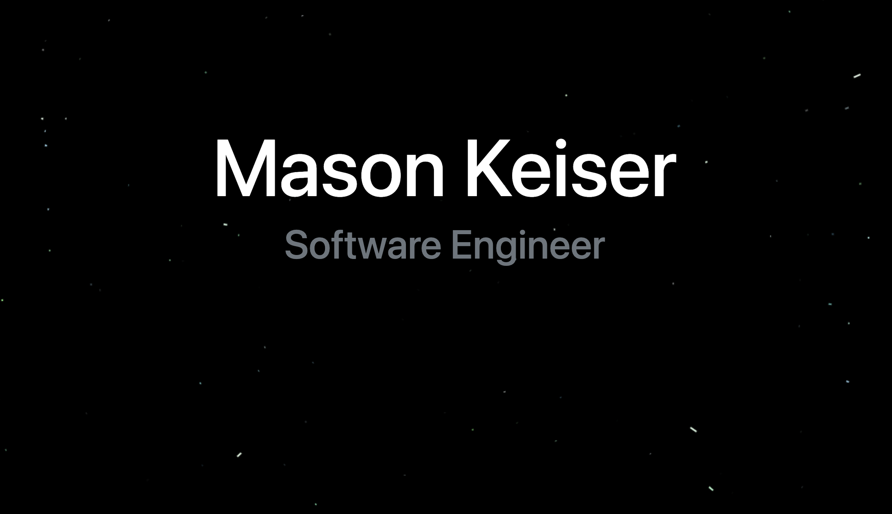

---

  
:zap: Github Statistics: 

  
  
 

---

## 💬 About me

#### My name is Mason, i'm a software engineer and a proud graduate of LearningFuze's full immersion coding program. I have an immense passion for coding, and learning process that goes into coding a project. My most recent project I am proud of was a full stack application that was built to assist medical patients in keeping track of their records (My-Health down in apps below 👇).

#### Before diving into software development I have 5 years of experience working as a medical assistant at an animal hospital. From that experience I gained the soft skills to effectively communicate and be a team player (as well as a team leader when needed). My years of honing my soft skills compliment my technical skills as well.

* 📚 My tech stack is React.js, JavaScript, CSS3, HTML5, Node.js, Express, and PostgreSQL
* 🛠 I use Bootstrap, npm, Babel, Webpack, Slack, and Photoshop
* 🌊 Outside of coding, I prefer to spend my time in the ocean, surfing

---

## 📫 Get in Touch

* Portfolio: https://masonkeiser.com
* LinkedIn: https://www.linkedin.com/in/mason-keiser-55323bb9/

---

### 👇 Check out my apps below 👇
